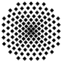
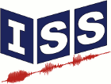

|                             |
|:-------------------------------------------------:|
|             **Universität Stuttgart**             |
| Institut für Signalverarbeitung und Systemtheorie |
|               Prof. Dr.-Ing. B. Yang              |
|                        |

# Bachelor's thesis / Resarch thesis / Master's thesis (Sxxx / Dxxxx)

# Title of the thesis
## Student
| Name       | Max Mustermann                   |
|------------|----------------------------------|
| Major      | Elektro- und Informationstechnik |
| Begin      | xx.xx.xxxx                       |
| End        | xx.xx.xxxx                       |
| Supervisor | xxxx                             |

## Abstract
Put your abstract here.

## Thesis

## Presentation

